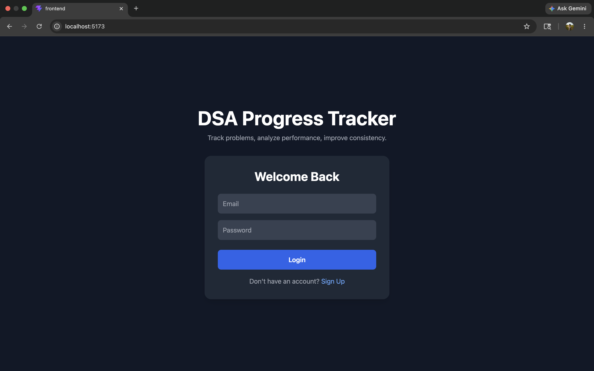
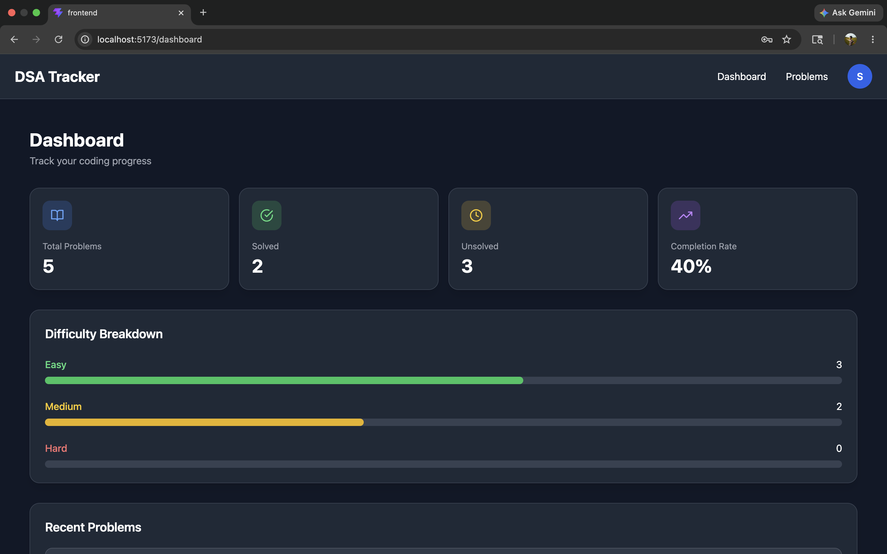
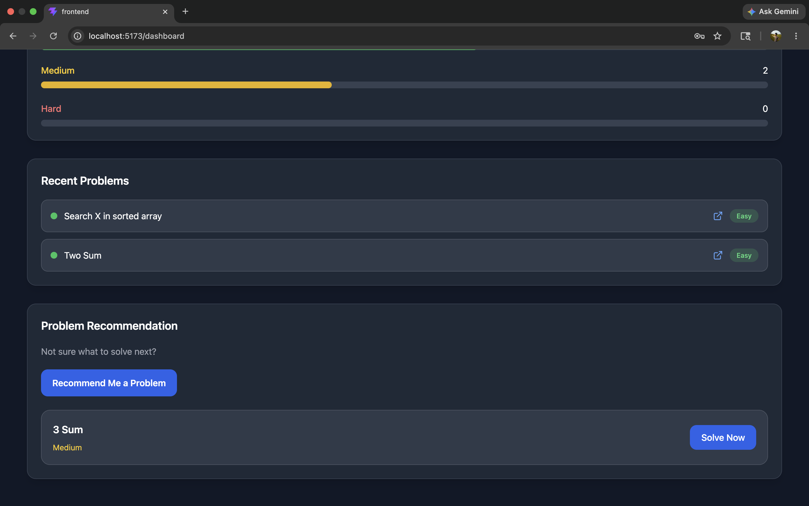
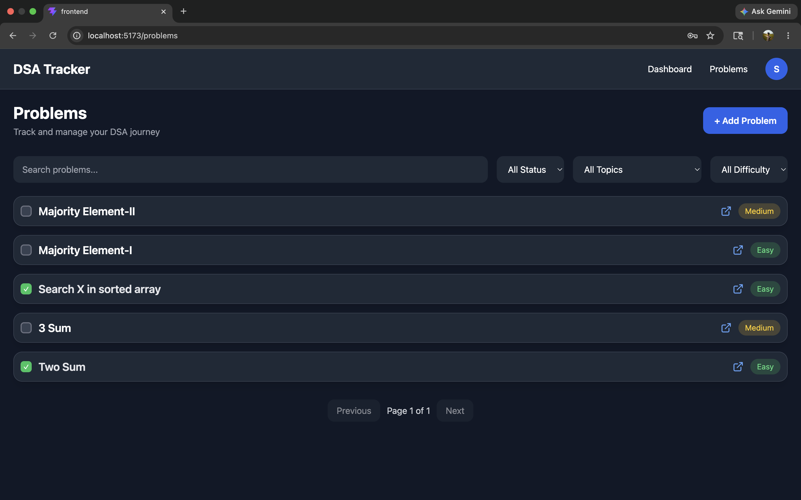
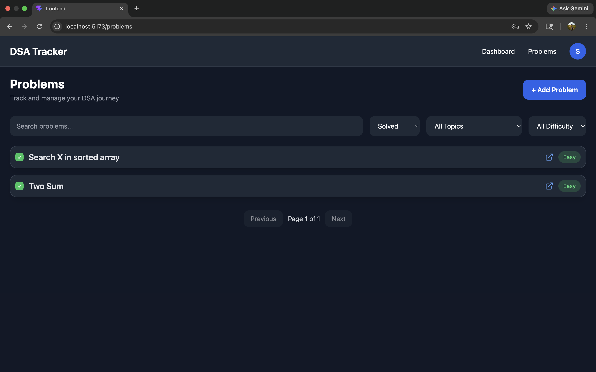
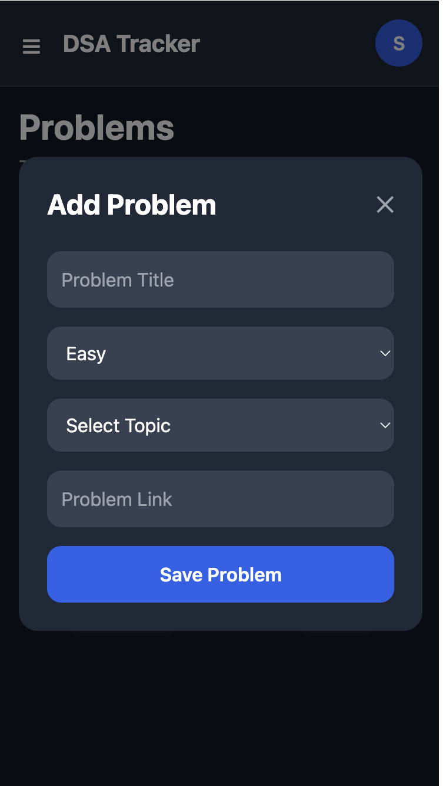
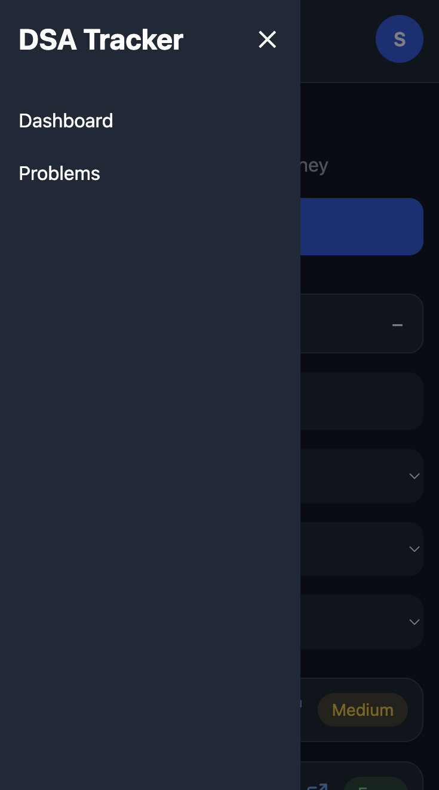
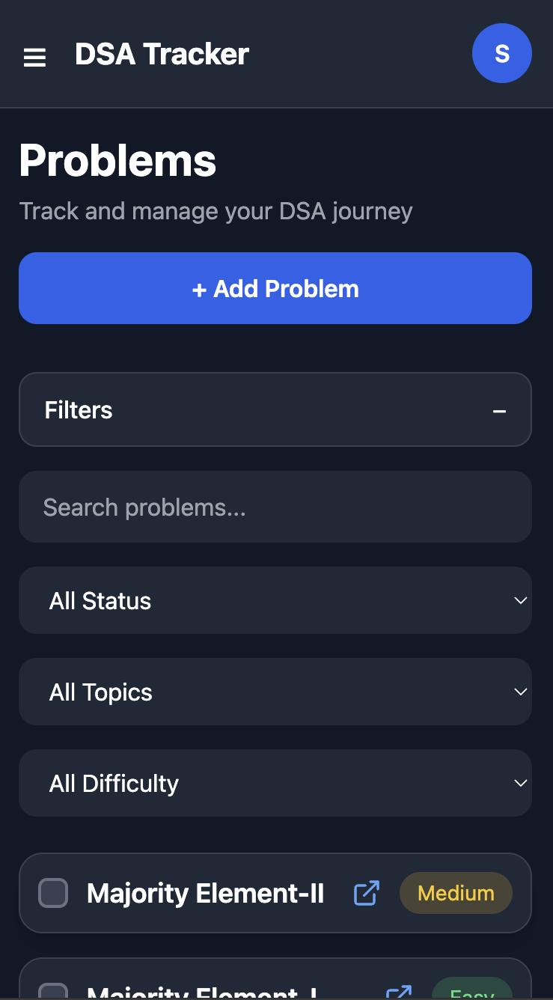

# DSA Tracker

A full-stack DSA problem tracking application that helps users organize, manage, and monitor their coding interview preparation journey.

---

# Features

- JWT Authentication
- Add and manage coding problems
- Track solved and unsolved problems
- Difficulty-based categorization
- Topic-based filtering
- Search functionality
- Responsive dashboard analytics
- Random problem recommendation
- Pagination support
- Mobile responsive UI

---

# Tech Stack

## Frontend

- React
- Tailwind CSS
- Axios
- React Router

## Backend

- FastAPI
- PostgreSQL
- SQLAlchemy
- JWT Authentication

---

# Dashboard Features

- Total Problems
- Solved Problems
- Unsolved Problems
- Completion Rate
- Difficulty Breakdown
- Recent Problems
- Problem Recommendation Widget

---

---

# Screenshots

## Login Page

<p align="center">
  
</p>

---

## Dashboard

### Dashboard Analytics

<p align="center">
  
</p>

### Recent Problems & Recommendations

<p align="center">
  
</p>

---

## Problems Page

### All Problems

<p align="center">
  
</p>

### Filters Applied

<p align="center">
  
</p>

---

## Mobile Responsive UI

<p align="center">
  
  
  
</p>

# Installation

## Clone Repository

```bash
git clone <your-github-repo-link>
cd DSA_Progress_Tracker
```

---

## Frontend Setup

```bash
cd frontend
npm install
npm run dev
```

---

## Backend Setup

```bash
cd backend
pip install -r requirements.txt
uvicorn main:app --reload
```

---

# Environment Variables

Create a `.env` file inside backend:

```env
DATABASE_URL=your_database_url
SECRET_KEY=your_secret_key
ALGORITHM=HS256
ACCESS_TOKEN_EXPIRE_MINUTES=30
```

---

# Project Structure

```txt
DSA_Progress_Tracker/
│
├── backend/
│   │
│   ├── app/
│   │   │
│   │   ├── core/
│   │   │   └── config.py
│   │   │
│   │   ├── database/
│   │   │   ├── database.py
│   │   │   └── dependencies.py
│   │   │
│   │   ├── models/
│   │   │   ├── problem_model.py
│   │   │   ├── topic_model.py
│   │   │   └── user_model.py
│   │   │
│   │   ├── routers/
│   │   │   ├── analytics_router.py
│   │   │   ├── auth_router.py
│   │   │   ├── problem_router.py
│   │   │   └── topic_router.py
│   │   │
│   │   ├── schemas/
│   │   │   ├── problem_schema.py
│   │   │   ├── topic_schema.py
│   │   │   └── user_schema.py
│   │   │
│   │   ├── utils/
│   │   │   ├── auth.py
│   │   │   └── seed_data.py
│   │   │
│   │   └── main.py
│   │
│   └── requirements.txt
│
├── frontend/
│   │
│   ├── src/
│   │   │
│   │   ├── components/
│   │   │   ├── Header.jsx
│   │   │   ├── Layout.jsx
│   │   │   ├── ProtectedRoute.jsx
│   │   │   ├── Sidebar.jsx
│   │   │   └── StatCard.jsx
│   │   │
│   │   ├── pages/
│   │   │   ├── Dashboard.jsx
│   │   │   ├── Login.jsx
│   │   │   ├── Problems.jsx
│   │   │   └── Signup.jsx
│   │   │
│   │   └── services/
│   │       └── api.js
│   │
│   └── package.json
│
├── screenshots/
│   ├── login.png
│   ├── dashboard-top.png
│   ├── dashboard-bottom.png
│   ├── problems-page.png
│   ├── problems-filters.png
│   ├── mobile-add-problem.png
│   ├── mobile-sidebar.png
│   └── mobile-filters.png
│
└── README.md
```

# Future Improvements

- Charts and analytics visualization
- AI-powered hints
- Notes feature
- Streak tracking
- Deployment

---

# Author

Jyothi Sunkara
